# Diagramme de Cas d'Utilisation - Plateforme e-Commerce

Ce diagramme représente les interactions entre les acteurs (Client et Administrateur) et le système e-commerce.

```mermaid
graph TB
    subgraph "Système e-Commerce"
        UC1[Parcourir le catalogue]
        UC2[Rechercher un produit]
        UC3[Consulter détails produit]
        UC4[Ajouter au panier]
        UC5[Modifier quantité panier]
        UC6[Supprimer du panier]
        UC7[Appliquer code réduction]
        UC8[Passer une commande]
        UC9[Suivre état commande]
        UC10[S'authentifier]
        
        UC11[Gérer produits]
        UC12[Ajouter produit]
        UC13[Modifier produit]
        UC14[Supprimer produit]
        UC15[Gérer stocks]
        UC16[Gérer prix]
        UC17[Consulter statistiques vente]
        UC18[Gérer coupons]
    end
    
    Client((Client))
    Admin((Administrateur))
    
    Client --> UC1
    Client --> UC2
    Client --> UC3
    Client --> UC4
    Client --> UC5
    Client --> UC6
    Client --> UC7
    Client --> UC8
    Client --> UC9
    Client --> UC10
    
    Admin --> UC10
    Admin --> UC11
    Admin --> UC15
    Admin --> UC17
    Admin --> UC18
    
    UC11 --> UC12
    UC11 --> UC13
    UC11 --> UC14
    UC11 --> UC16
    
    UC1 -.include.-> UC10
    UC4 -.include.-> UC10
    UC8 -.include.-> UC10
    UC9 -.include.-> UC10
    
    UC8 -.extend.-> UC7
```

## Description des Cas d'Utilisation

### Côté Client

| Cas d'utilisation | Description |
|-------------------|-------------|
| **Parcourir le catalogue** | Le client navigue à travers les différentes catégories et produits disponibles |
| **Rechercher un produit** | Le client effectue une recherche par mot-clé ou filtre |
| **Consulter détails produit** | Le client consulte les informations détaillées d'un produit (description, prix, images, disponibilité) |
| **Ajouter au panier** | Le client ajoute un ou plusieurs produits à son panier |
| **Modifier quantité panier** | Le client modifie la quantité d'un produit dans le panier |
| **Supprimer du panier** | Le client retire un produit de son panier |
| **Appliquer code réduction** | Le client applique un coupon de réduction sur son panier |
| **Passer une commande** | Le client valide son panier et crée une commande |
| **Suivre état commande** | Le client consulte le statut de ses commandes (en cours, expédiée, livrée) |
| **S'authentifier** | Le client se connecte ou crée un compte |

### Côté Administrateur

| Cas d'utilisation | Description |
|-------------------|-------------|
| **Gérer produits** | L'admin effectue des opérations CRUD sur les produits |
| **Ajouter produit** | L'admin crée un nouveau produit dans le catalogue |
| **Modifier produit** | L'admin met à jour les informations d'un produit existant |
| **Supprimer produit** | L'admin retire un produit du catalogue |
| **Gérer stocks** | L'admin consulte et met à jour les niveaux de stock |
| **Gérer prix** | L'admin modifie les prix des produits |
| **Consulter statistiques vente** | L'admin consulte les rapports et analyses de vente |
| **Gérer coupons** | L'admin crée, modifie ou désactive des codes de réduction |

## Relations

- **include** : Relation de dépendance (ex: pour passer commande, il faut être authentifié)
- **extend** : Relation optionnelle (ex: appliquer un coupon est optionnel lors du passage de commande)

