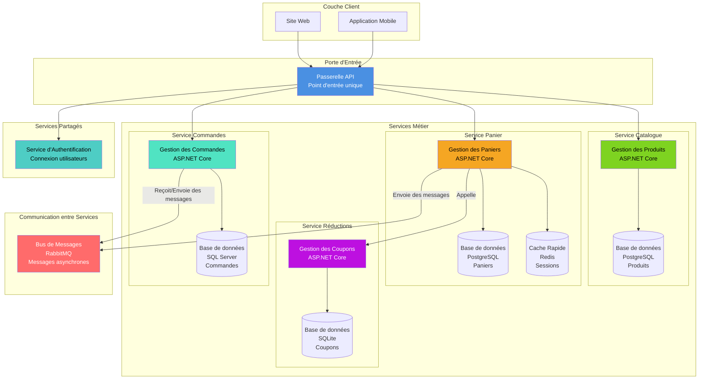

# Diagramme de Composants - Architecture e-Commerce

Ce diagramme montre comment les différents services de la plateforme e-commerce communiquent entre eux.

## Vue Simplifiée



## 📋 Explication Simple de l'Architecture

### 🖥️ Ce que voit l'utilisateur

| Composant | À quoi ça sert |
|-----------|----------------|
| **Site Web** | Page internet où les clients achètent (comme Amazon) |
| **Application Mobile** | Application sur téléphone pour faire des achats |

### 🚪 La Porte d'Entrée Unique

| Composant | À quoi ça sert |
|-----------|----------------|
| **Passerelle API** | C'est la porte d'entrée unique. Toutes les requêtes passent par là avant d'aller vers les bons services. Elle vérifie aussi que l'utilisateur est bien connecté. |

---

## 🎯 Les 4 Services Principaux

### 1️⃣ Service Catalogue 🛍️

**Ce qu'il fait :**
- Affiche tous les produits disponibles
- Permet de chercher un produit
- Montre les détails d'un produit (prix, description, photos)
- Gère les catégories de produits

**Sa base de données :** PostgreSQL (pour stocker tous les produits)

---

### 2️⃣ Service Panier 🛒

**Ce qu'il fait :**
- Permet d'ajouter des produits au panier
- Calcule le total du panier
- Modifie les quantités
- Supprime des produits du panier
- Applique les codes de réduction

**Ses bases de données :**
- **PostgreSQL** : pour sauvegarder les paniers
- **Redis** : un cache super rapide pour accéder aux paniers en un instant

**Communication :**
- Parle avec le **Service Réductions** pour vérifier les codes promo

---

### 3️⃣ Service Réductions 🎟️

**Ce qu'il fait :**
- Crée des codes de réduction (coupons)
- Vérifie si un code promo est valide
- Calcule la réduction à appliquer

**Sa base de données :** SQLite (une petite base de données simple)

---

### 4️⃣ Service Commandes 📦

**Ce qu'il fait :**
- Crée une commande quand le client achète
- Suit l'état de la commande (en cours, expédiée, livrée)
- Garde l'historique de toutes les commandes
- Gère les adresses de livraison

**Sa base de données :** SQL Server (pour des données importantes et sécurisées)

---

## 📨 Comment les Services Communiquent

### Bus de Messages (RabbitMQ)

C'est comme un facteur qui transporte des messages entre les services :

**Exemple :**
1. Le client valide son panier
2. Le **Service Panier** envoie un message : "Un client veut commander !"
3. Le **Service Commandes** reçoit le message et crée la commande
4. Le **Service Commandes** envoie un nouveau message : "Commande créée !"
5. D'autres services (comme les notifications) peuvent recevoir ce message

**Avantage :** Si un service est occupé ou en panne, le message attend sagement qu'il soit disponible.

---

## 🔐 Service d'Authentification

**Ce qu'il fait :**
- Vérifie l'identité des utilisateurs (connexion)
- S'assure qu'un utilisateur a le droit de faire une action
- Gère les comptes clients et administrateurs

---

## 💾 Pourquoi Différentes Bases de Données ?

Chaque service utilise la base de données la mieux adaptée à son travail :

| Service | Base de données | Pourquoi ce choix |
|---------|----------------|-------------------|
| **Catalogue** | PostgreSQL | Beaucoup de produits à gérer, recherches complexes |
| **Panier** | PostgreSQL + Redis | Redis = super rapide pour les paniers actifs |
| **Réductions** | SQLite | Peu de données, simple à gérer |
| **Commandes** | SQL Server | Données sensibles, transactions sécurisées |

---

## 🔄 Comment Ça Marche Ensemble ?

### Exemple : Un client achète un produit

1. **Client** ouvre le site web
2. **Site Web** → **Passerelle API** : "Montre-moi les produits"
3. **Passerelle API** → **Service Catalogue** : "Donne-moi les produits"
4. **Service Catalogue** → **Base PostgreSQL** : récupère les produits
5. Les produits s'affichent au client ✅

6. **Client** ajoute au panier
7. **Site Web** → **Passerelle API** → **Service Panier** : "Ajoute ce produit"
8. **Service Panier** → **Redis** : sauvegarde dans le cache rapide ✅

9. **Client** applique un code promo "NOEL2025"
10. **Service Panier** → **Service Réductions** : "Ce code est-il valide ?"
11. **Service Réductions** répond : "Oui, -20% !" ✅

12. **Client** valide sa commande
13. **Service Panier** → **Bus de Messages** : "Nouveau panier à transformer en commande !"
14. **Service Commandes** reçoit le message et crée la commande dans SQL Server ✅
15. **Service Commandes** → **Bus de Messages** : "Commande créée, envoyez un email !" 📧

---

## 🐳 Déploiement avec Docker

Tous les services sont dans des conteneurs Docker (comme des boîtes isolées) :

```
📦 Conteneur 1 : Service Catalogue + PostgreSQL
📦 Conteneur 2 : Service Panier + PostgreSQL + Redis
📦 Conteneur 3 : Service Réductions + SQLite
📦 Conteneur 4 : Service Commandes + SQL Server
📦 Conteneur 5 : Passerelle API
📦 Conteneur 6 : RabbitMQ (Bus de messages)
```

**Avantage :** On peut démarrer toute l'application avec une seule commande !

---

## ✅ Points Clés à Retenir

1. **Chaque service fait UNE chose** : Catalogue, Panier, Réductions, Commandes
2. **Chaque service a SA base de données** : pas de partage
3. **La Passerelle est la porte d'entrée** : tout passe par là
4. **Les services communiquent de 2 façons :**
   - **Directement** : pour des réponses immédiates
   - **Par messages** : pour ne pas se bloquer mutuellement
5. **Docker permet de tout lancer facilement** : un clic et tout démarre

