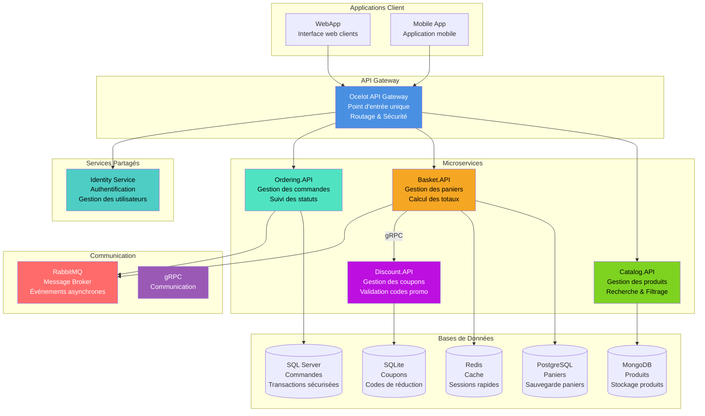

# Diagramme de Composants - Architecture e-Commerce

Ce diagramme montre comment les différents services de la plateforme e-commerce communiquent entre eux.

## Vue Simplifiée



## 📋 Architecture Microservices e-Commerce

### 🖥️ Applications Client

| Composant | Description |
|-----------|-------------|
| **WebApp** | Application web pour les clients |
| **Mobile App** | Application mobile pour smartphones |

### 🚪 API Gateway

| Composant | Description |
|-----------|-------------|
| **Ocelot API Gateway** | Point d'entrée unique, routage et sécurité |

### 🎯 Microservices

| Service | Rôle | Base de données |
|---------|------|----------------|
| **Catalog.API** | Gestion des produits | MongoDB |
| **Basket.API** | Gestion des paniers | PostgreSQL + Redis |
| **Discount.API** | Gestion des coupons | SQLite |
| **Ordering.API** | Gestion des commandes | SQL Server |

### 📨 Communication

| Composant | Rôle |
|-----------|------|
| **RabbitMQ** | Message Broker pour communication asynchrone |
| **gRPC** | Communication haute performance entre services |
| **Identity Service** | Authentification et autorisation |

## 🔄 Flux de Communication

### Communication Synchrone
- **WebApp/Mobile** → **Ocelot API Gateway** → **Microservices**
- **Basket.API** → **Discount.API** (gRPC)

### Communication Asynchrone
- **Basket.API** → **RabbitMQ** → **Ordering.API**
- Messages d'événements entre services

## 🏗️ Avantages de cette Architecture

### ✅ Indépendance des Services
- Chaque microservice a sa propre base de données
- Déploiement et scaling indépendants
- Technologie adaptée par service

### ✅ Résilience
- Si un service tombe, les autres continuent
- Messages asynchrones avec RabbitMQ
- Pas de point de défaillance unique

### ✅ Performance
- Redis pour cache rapide des paniers
- Bases de données optimisées par usage
- Communication gRPC haute performance

## 🐳 Containerisation

Tous les services sont containerisés avec Docker :

```yaml
services:
  - catalog.api + postgresql
  - basket.api + postgresql + redis  
  - discount.api + sqlite
  - ordering.api + sqlserver
  - ocelot.api.gateway
  - rabbitmq
```

## 📊 Technologies Utilisées

| Composant | Technologie |
|-----------|-------------|
| **API Gateway** | Ocelot |
| **Microservices** | ASP.NET Core |
| **Message Broker** | RabbitMQ |
| **Bases de données** | MongoDB, PostgreSQL, Redis, SQLite, SQL Server |
| **Containerisation** | Docker Compose |

