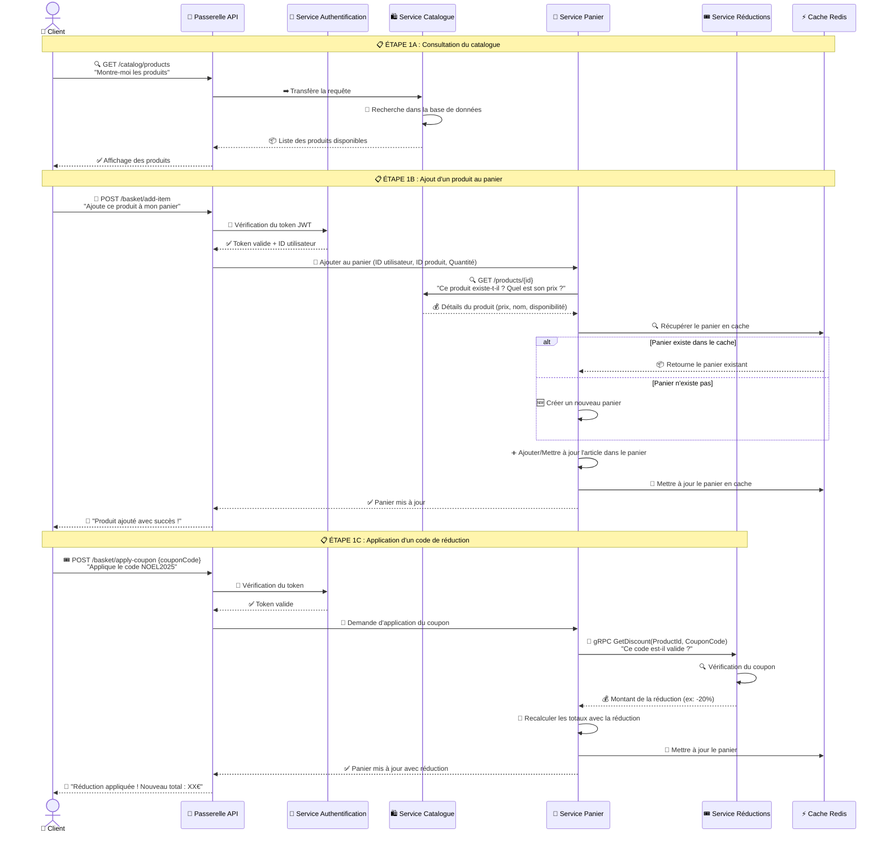
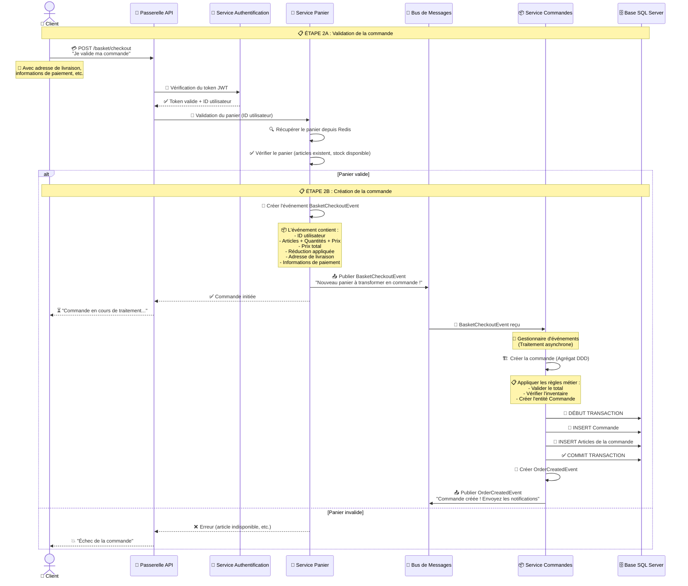
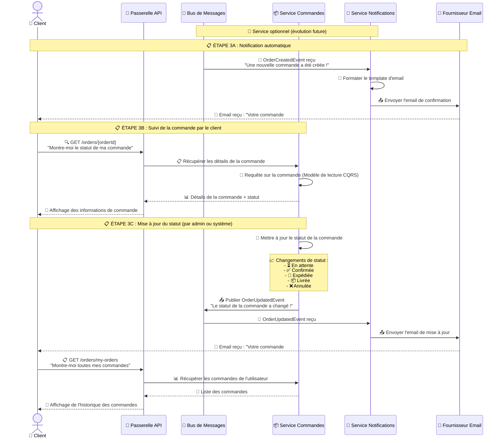

# 🛒 Diagramme de Séquence - Parcours d'une Commande

Ce diagramme illustre le flux complet d'une commande depuis l'ajout au panier jusqu'à la notification, incluant les interactions entre tous les microservices.

## 🛍️ ÉTAPE 1 : Consultation du Catalogue et Ajout au Panier

## 💳 ÉTAPE 2 : Passage de Commande (Checkout)

## 📧 ÉTAPE 3 : Notification et Suivi de Commande

## 📋 Description des Flux

### 🛍️ Flux 1 : Consultation du Catalogue et Ajout au Panier

**Étapes clés :**

1. **🔍 Consultation du catalogue** : Le client parcourt les produits via le Service Catalogue
2. **🔑 Authentification** : La Passerelle API valide le token JWT via le Service Authentification
3. **🛒 Ajout au panier** : 
   - Le Service Panier vérifie le produit auprès du Service Catalogue
   - Récupère ou crée le panier depuis Redis (cache super rapide)
   - Ajoute l'article et met à jour le cache
4. **🎟️ Application coupon** :
   - Communication gRPC synchrone avec le Service Réductions
   - Validation du coupon et récupération du montant de réduction
   - Recalcul des totaux avec la réduction appliquée

**Pattern utilisé :** Cache-Aside Pattern avec Redis ⚡

### 💳 Flux 2 : Passage de Commande (Checkout)

**Étapes clés :**

1. **✅ Validation du panier** : Vérification des articles, stock disponible, prix
2. **📤 Publication événement** : BasketCheckoutEvent publié vers RabbitMQ
3. **🔄 Traitement asynchrone** :
   - Le Service Commandes souscrit à l'événement
   - Crée la commande avec les règles métier (DDD)
   - Sauvegarde dans SQL Server avec transaction sécurisée
4. **📧 Notification** : OrderCreatedEvent publié pour les autres services

**Patterns utilisés :** 
- 🏗️ Event-Driven Architecture
- 📋 Saga Pattern (implicite)
- 🔄 CQRS (Command pour créer la commande)

### 📧 Flux 3 : Notification et Suivi

**Étapes clés :**

1. **📨 Notification automatique** : Service abonné aux événements envoie des emails
2. **🔍 Consultation commande** : CQRS Read Model pour requêtes optimisées
3. **🔄 Mise à jour statut** : Événements OrderUpdatedEvent pour communication asynchrone
4. **📋 Historique** : Le client peut consulter toutes ses commandes

**Patterns utilisés :**
- 👀 Observer Pattern (via RabbitMQ)
- 🔄 CQRS (Read Model optimisé pour les requêtes)

## 🏗️ Avantages de cette Architecture

### 🛡️ Résilience
- Si le Service Commandes est en panne, le BasketCheckoutEvent reste dans RabbitMQ et sera traité plus tard
- Les services sont découplés grâce à la communication asynchrone
- Un service en panne n'empêche pas les autres de fonctionner

### ⚡ Performance
- Redis cache pour accès ultra-rapide aux paniers
- gRPC pour communication haute performance (Service Réductions)
- CQRS pour séparer lecture/écriture et optimiser les performances

### 📈 Scalabilité
- Chaque service peut être scalé indépendamment selon ses besoins
- RabbitMQ gère la charge avec des queues intelligentes
- Possibilité d'ajouter des instances de services selon la demande

### 🔍 Observabilité
- Chaque interaction est traçable et loggée
- Logs centralisés permettent de suivre le parcours complet d'une commande
- Monitoring en temps réel de tous les services

## 🚨 Gestion des Erreurs

| Scénario | Gestion |
|----------|---------|
| **❌ Produit inexistant** | Le Service Panier vérifie avec le Service Catalogue avant ajout, retourne erreur 404 |
| **❌ Coupon invalide** | Le Service Réductions retourne réduction = 0, le panier n'est pas modifié |
| **❌ Service en panne** | La Passerelle API retourne erreur 503, le client peut réessayer plus tard |
| **❌ Événement perdu** | RabbitMQ garantit la livraison (messages persistants) |
| **❌ Transaction échouée** | Rollback automatique de la transaction SQL Server |

## 📡 Types de Communication

| Type | Usage | Avantages | Inconvénients |
|------|-------|-----------|---------------|
| **🌐 REST API** | Passerelle ↔ Services, Services ↔ Services | Standard, facile à déboguer | Plus lent que gRPC |
| **🚀 gRPC** | Panier → Réductions | Haute performance, typage fort | Plus complexe à implémenter |
| **📨 RabbitMQ** | Événements asynchrones | Découplage, résilience | Complexité, eventual consistency |

