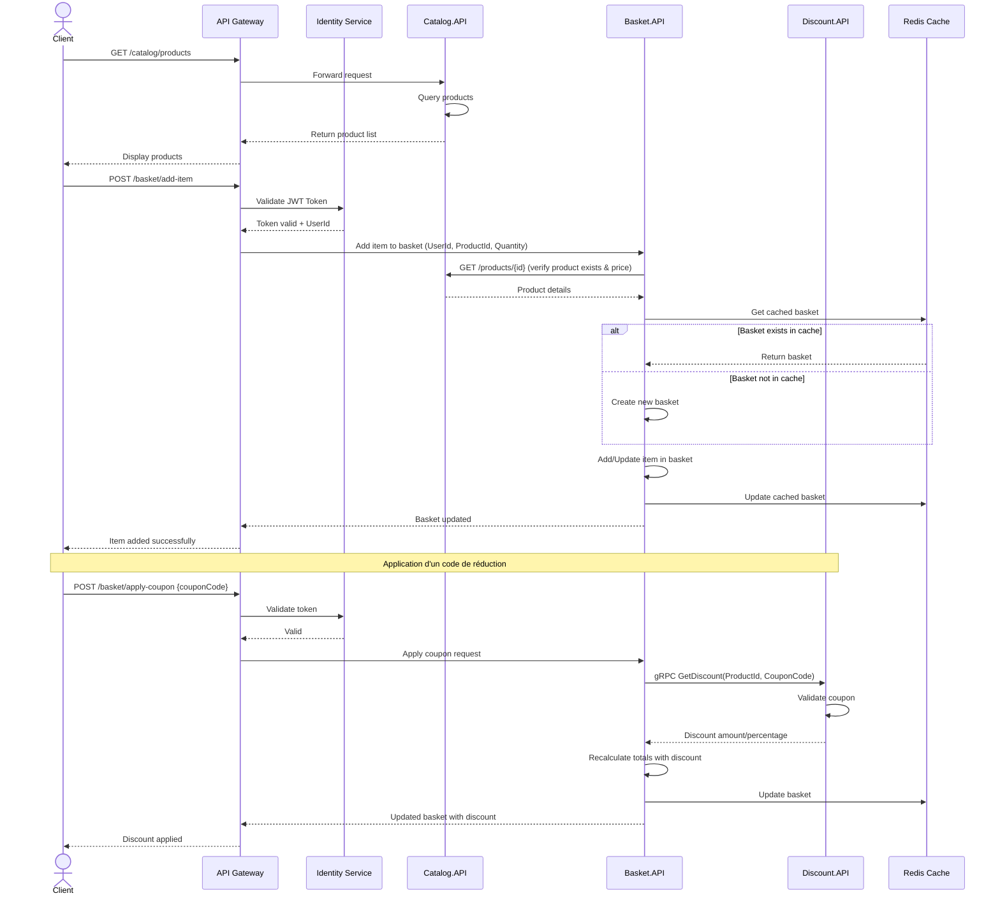
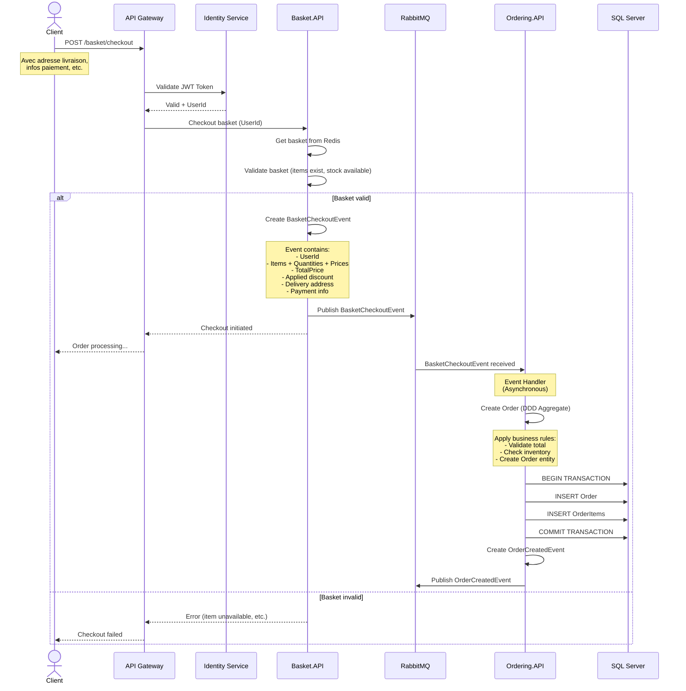
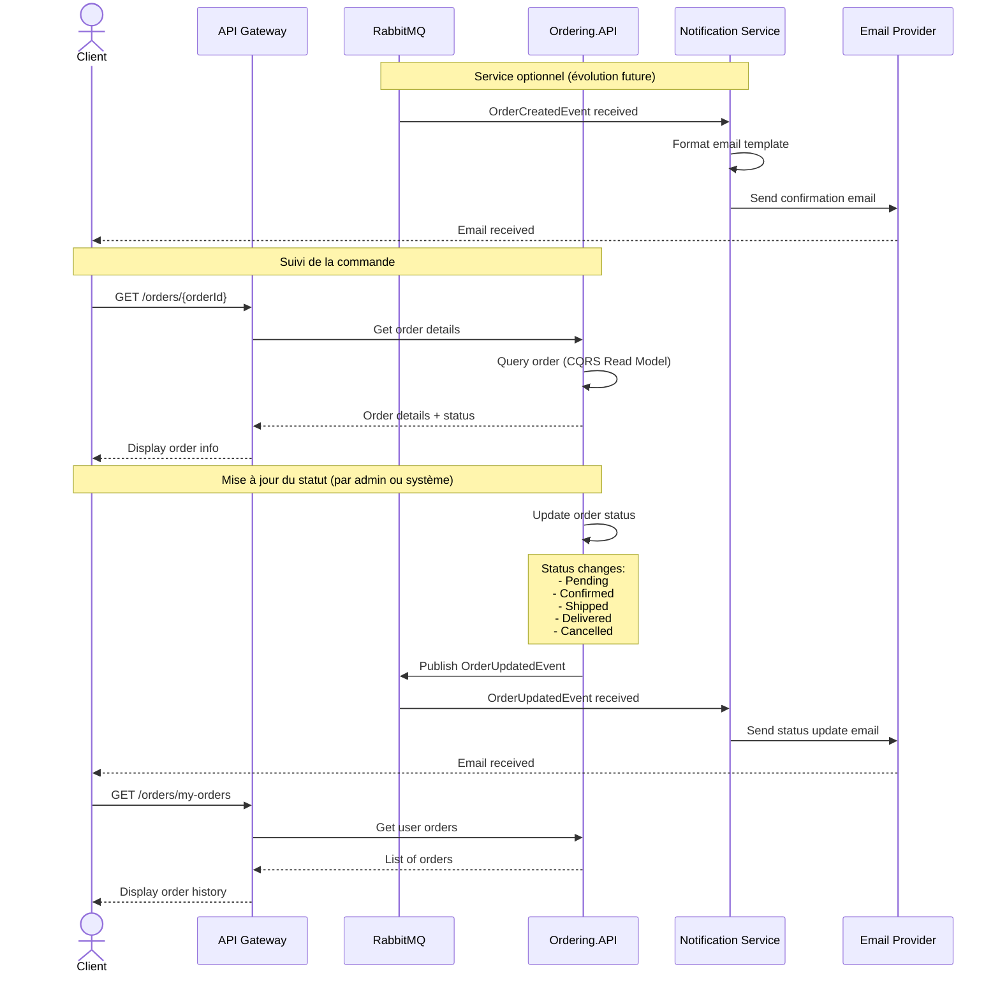

# Diagramme de Séquence - Parcours d'une Commande

Ce diagramme illustre le flux complet d'une commande depuis l'ajout au panier jusqu'à la notification, incluant les interactions entre tous les microservices.

## 1. Ajout au Panier et Application de Réduction

## 2. Passage de Commande (Checkout)

## 3. Notification et Suivi de Commande

## Description des Flux

### Flux 1 : Ajout au Panier et Application de Réduction

**Étapes clés :**

1. **Consultation du catalogue** : Le client parcourt les produits via Catalog.API
2. **Authentification** : L'API Gateway valide le JWT token via Identity Service
3. **Ajout au panier** : 
   - Basket.API vérifie le produit auprès de Catalog.API
   - Récupère ou crée le panier depuis Redis (cache)
   - Ajoute l'item et met à jour le cache
4. **Application coupon** :
   - Communication gRPC synchrone avec Discount.API
   - Validation du coupon et récupération du montant
   - Recalcul des totaux avec réduction

**Pattern utilisé :** Cache-Aside Pattern avec Redis

### Flux 2 : Passage de Commande (Checkout)

**Étapes clés :**

1. **Validation du panier** : Vérification des items, stock, prix
2. **Publication événement** : BasketCheckoutEvent publié vers RabbitMQ
3. **Traitement asynchrone** :
   - Ordering.API souscrit à l'événement
   - Crée la commande avec les règles métier (DDD)
   - Persiste dans SQL Server avec transaction
4. **Notification** : OrderCreatedEvent publié pour autres services

**Patterns utilisés :** 
- Event-Driven Architecture
- Saga Pattern (implicite)
- CQRS (Command pour créer la commande)

### Flux 3 : Notification et Suivi

**Étapes clés :**

1. **Notification automatique** : Service abonné aux événements envoie des emails
2. **Consultation commande** : CQRS Read Model pour requêtes optimisées
3. **Mise à jour statut** : Événements OrderUpdatedEvent pour communication asynchrone
4. **Historique** : Client peut consulter toutes ses commandes

**Patterns utilisés :**
- Observer Pattern (via RabbitMQ)
- CQRS (Read Model optimisé pour les requêtes)

## Avantages de cette Architecture

### Résilience
- Si Ordering.API est down, le BasketCheckoutEvent reste dans RabbitMQ et sera traité plus tard
- Les services sont découplés grâce à la communication asynchrone

### Performance
- Redis cache pour accès rapide aux paniers
- gRPC pour communication haute performance (Discount)
- CQRS pour séparer lecture/écriture

### Scalabilité
- Chaque service peut être scalé indépendamment
- RabbitMQ gère la charge avec des queues

### Observabilité
- Chaque interaction est traçable
- Logs centralisés permettent de suivre le parcours complet

## Gestion des Erreurs

| Scénario | Gestion |
|----------|---------|
| **Produit inexistant** | Basket.API vérifie avec Catalog avant ajout, retourne erreur 404 |
| **Coupon invalide** | Discount.API retourne discount = 0, le panier n'est pas modifié |
| **Service down** | API Gateway retourne erreur 503, client réessaie plus tard |
| **Événement perdu** | RabbitMQ garantit la livraison (persistent messages) |
| **Transaction échouée** | Rollback automatique de la transaction SQL Server |

## Communication

| Type | Usage | Avantages | Inconvénients |
|------|-------|-----------|---------------|
| **REST API** | Gateway ↔ Services, Services ↔ Services | Standard, facile à déboguer | Plus lent que gRPC |
| **gRPC** | Basket → Discount | Haute performance, typage fort | Plus complexe |
| **RabbitMQ** | Événements asynchrones | Découplage, résilience | Complexité, eventual consistency |

